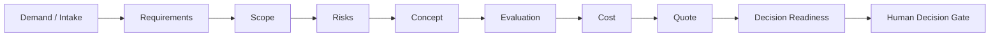

# Architecture

## Public showcase



## Core design ideas

### Project and revision are different concepts

The project is the stable identity. Scope, cost, risk and decision evolve through explicit revisions.

A relevant scope change should be able to invalidate a stale cost or decision instead of silently preserving an old conclusion.

### Information has nature

The system should distinguish:

- real / verified;
- user-declared;
- imported;
- estimated;
- calculated;
- AI-suggested;
- demo;
- unknown.

The public demo intentionally uses `DEMO`, `ESTIMATED`, `CALCULATED` and `UNKNOWN`.

### Risk is not the decision

Probability × severity can support prioritization, but a risk score does not automatically authorize or reject an engineering project.

### Cost is not price

The internal cost base and the commercial sale price are separate concepts. A quote remains incomplete while required commercial inputs are unknown.

### Readiness is not approval

Readiness answers whether the information required for a human decision is present.

Even when every readiness signal is available, the public logic returns:

`READY_FOR_HUMAN_DECISION`

—not `GO`.

## Assurance concept

Higher-impact engineering artifacts may require a stronger review path:

```text
AUTHOR
  -> DETERMINISTIC CHECKS
  -> INDEPENDENT REVIEW
  -> [ADVERSARIAL REVIEW]
  -> [ADJUDICATION]
  -> HUMAN GATE
  -> RELEASE
```

The public showcase documents this pattern but does not pretend to provide certified independent engineering review.
